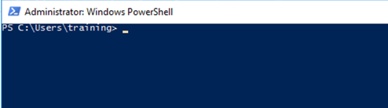
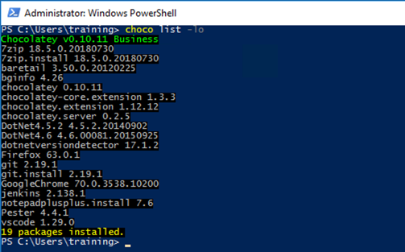
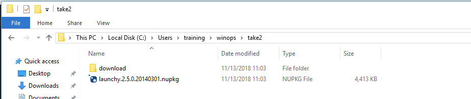

@title[Setting Up Internal Chocolatey Deployments]

## Setting Up Internal Chocolatey Deployments
### Using Jenkins and Package Internalizer

---?image=assets/images/cf2018-sponsors.png&size=contain&color=white
@title[ChocolateyFest Sponsors]
@transition[none]

---?image=assets/images/wifi.png&size=contain&color=white
@title[Wifi]
@transition[none]

---

@title[Who Am I? - Gary Ewan Park]
@transition[none]

@snap[north-west]
@css[choco-blue](WHO AM I?)
@snapend

@snap[west span-65]
Senior Software Engineer @ Chocolatey Software
 
 

@snapend

@snap[east span-30]

 
@css[bio-name](Gary Ewan Park)
@snapend

@snap[south-west bio-contact]
@fa[twitter twitter-blue]&nbsp;&nbsp;gep13&nbsp;&nbsp;&nbsp;&nbsp;&nbsp;
@fa[github text-black]&nbsp;&nbsp;github.com/gep13&nbsp;&nbsp;&nbsp;&nbsp;&nbsp;
@fa[home text-blue]&nbsp;&nbsp;gep13.co.uk&nbsp;&nbsp;&nbsp;&nbsp;&nbsp;
@fa[envelope choco-blue]&nbsp;&nbsp;gary@chocolatey.io
@snapend

---
@title[Who Am I? - Paul Broadwith]
@transition[none]

@snap[north-west]
@css[choco-blue](WHO AM I?)
@snapend

@snap[west span-65]
Senior Technical Engineer @ Chocolatey Software
 
 
25+ years in IT in the defence, government, financial services and nuclear industry sectors
@snapend

@snap[east span-30]

 
@css[bio-name](Paul Broadwith)
@snapend

@snap[south-west bio-contact]
@fa[twitter twitter-blue]&nbsp;&nbsp;pauby&nbsp;&nbsp;&nbsp;&nbsp;&nbsp;
@fa[github text-black]&nbsp;&nbsp;github.com/pauby&nbsp;&nbsp;&nbsp;&nbsp;&nbsp;
@fa[home text-blue]&nbsp;&nbsp;pauby.com&nbsp;&nbsp;&nbsp;&nbsp;&nbsp;
@fa[envelope choco-blue]&nbsp;&nbsp;paul@chocolatey.io
@snapend

---

@title[Agenda]
@transition[none]

@snap[north-west]
@css[choco-blue](Agenda)
@snapend

@title[Agenda]
@transition[none]

@snap[north-west]
@css[choco-blue](Agenda)
@snapend

@snap[west]
@ul
- 18:30: Workshop Starts
- 19:30: Comfort Break
- 20:30: Comfort Break
- 21:30: Workshop Ends
@ulend
  
Please feel free to interrupt for any questions that you might have.
@snapend

---
@title[Agenda]
@transition[none]

@snap[north-west]
Agenda
@snapend

@snap[west]
@ul
- Get access to Workshop Environments
- Chocolatey Fundamentals
- Manual Internalization
- Package Internalizer Fundamentals
- Automatic Package Internalization
@ulend
@snapend
---

@title[Pre-Requisites]
@transition[none]

@snap[north-west]
@css[choco-blue](Pre-Requisites)
@snapend

@snap[west]
@ul
- Computer with network connection and RDP client
  - on Windows, you are probably all set
  - on macOS, get Microsoft Remote Desktop from the App Store
  - on Linux, get [rdesktop](https://wiki.ubuntuusers.de/rdesktop/)
- Some Chocolatey knowledge
  - but it's OK if you are not a Chocolatey expert!)
@ulend
@snapend
---

@title[Hands-on Sections]
@transition[none]

@snap[north-west]
@css[choco-blue](Hands-on Sections)
@snapend

@snap[north span-100]
  
@ul
- Uses Chocolatey 0.10.11, Chocolatey.Server 0.2.5, and Jenkins 2.138.1
- All hands-on section are clearly identified, like the rectangle below:
@ulend
@snapend

@snap[south exercise-box]

@fa[keyboard-o]()&nbsp;Exercise
 
@ul
- This is the stuff you are supposed to do!
- Go to https://gitpitch.com/gep13/chocolatey-internalizer-workshop/master to view these slides.
@ulend

@snapend

---

@title[Terminals]
@transition[none]

@snap[north-west]
@css[choco-blue](Terminals)
@snapend

Once in a while, the instructions will say:

@quote[Open a new terminal]

This needs to be an Administrator session.
* Press [Windows], type `powershell`, right click on entry and select `Run as Administrator`

---

@title[Test RDP Access]
@transition[none]

@snap[north-west]
@css[choco-blue](Test RDP Access)
@snapend

You should have been given a piece of paper like this:

Test login credentials to make sure you have access.

**NOTE:** Initial login will likely cause a reboot of VM.

---

## Chocolatey Fundamentals

+++

@title[What is Chocolatey?]

## What is Chocolatey?

+++

@title[A Definition...]

### A Definition...

@quote[Chocolatey is a package manager for Windows, like apt-get or yum but for Windows. It was designed to be a decentralized framework for quickly installing applications and tools that you need. It is built on the NuGet infrastructure currently using PowerShell as its focus for delivering packages from the distros to your door, err computer.]

+++

@title[It's Magic!]

+++

## Install putty

@snap[center exercise-box]

@fa[keyboard-o]()&nbsp;Exercise
 

<pre><code class="lang-powershell hljs">choco install putty</code></pre>

@snapend

+++

## Result

+++

## List local packages

@snap[center exercise-box]

@fa[keyboard-o]()&nbsp;Exercise
 

<pre><code class="lang-powershell hljs">choco list -lochoco list --local-only</code></pre>
@snapend

+++

## Result

+++

## List all packages

@snap[center exercise-box]

@fa[keyboard-o]()&nbsp;Exercise
 

<pre><code class="lang-powershell hljs">choco list -lichoco list --local-only --include-programs</code></pre>
@snapend

+++

## Result

+++

## Upgrade all packages

@snap[center exercise-box]

@fa[keyboard-o]()&nbsp;Exercise
 

<pre><code class="lang-powershell hljs">choco upgrade all</code></pre>

+++

## Result

+++

## Viewing Chocolatey Sources

@snap[center exercise-box]

@fa[keyboard-o]()&nbsp;Exercise
 

<pre><code class="lang-powershell hljs">choco sourcechoco source list</code></pre>

+++

## Result

+++

## Checking for outdated packages

@snap[center exercise-box]

@fa[keyboard-o]()&nbsp;Exercise
 

<pre><code class="lang-powershell hljs">choco outdated</code></pre>

+++

## Result

+++

## Reduce size of files on disk

@snap[center exercise-box]

@fa[keyboard-o]()&nbsp;Exercise
 

<pre><code class="lang-powershell hljs">choco optimizechoco optimize --reduce-nupkg-only</code></pre>

+++

## Result

---

@title[Why do I need to internalize packages?]
## Why do I need to internalize packages?

+++

* Reliability
* Trust and Control
* https://chocolatey.org/docs/community-packages-disclaimer

---

## Manual Internalization

@snap[center exercise-box]

@fa[keyboard-o]()&nbsp;Exercise
 

<pre><code class="lang-powershell hljs">mkdir chocolateyfestcd chocolateyfestchoco download putty.installii .</code></pre>

+++

## Result

+++

+++

## That was too easy...

@snap[center exercise-box]

@fa[keyboard-o]()&nbsp;Exercise
 

<pre><code class="lang-powershell hljs">choco download launchy</code></pre>

+++

## Result

+++

+++

## Perform manual internalization steps

@snap[center exercise-box]

@fa[keyboard-o]()&nbsp;Exercise
 

@ul
- Download Launchy.exe
- Place within the chocolatey package folder
- Modify chocolateyInstall.ps1 file to use new location
- Switch to using `Install-ChocolateyInstallPackage`
- Or use `-UseOriginalLocation` flag
- Run `choco pack` to generate package
- Deploy and test
@ulend

+++

## The easy way...

@snap[center exercise-box]

@fa[keyboard-o]()&nbsp;Exercise
 

<pre><code class="lang-powershell hljs">choco download launchy &#x60;  --internalize &#x60;  --internalize-all-urls &#x60;  --append-use-original-location

@snapend

+++

## Result

+++

+++

## Push Package to Chocolatey.Server

@snap[center exercise-box]

@fa[keyboard-o]()&nbsp;Exercise
 

<pre><code class="lang-powershell hljs">choco source listchoco list --source="'http://localhost/chocolatey'"choco push ./launchy.2.5.0.20140301.nupkg `
  --source="'http://localhost/chocolatey'"
</code></pre>

This will error out.  We need to know the Api Key to push packages to this feed

@snapend

+++

## Get Api Key

@snap[center exercise-box]

@fa[keyboard-o]()&nbsp;Exercise
 

@ul
- Navigate to `C:\tools\chocolatey.server`
- Open `web.config` file in text editor
- Search for `apiKey`
- Take a note of the value
@ulend

@snapend

+++

## Push Package to Chocolatey.Server - Take 2

@snap[center exercise-box]

@fa[keyboard-o]()&nbsp;Exercise
 

<pre><code class="lang-powershell hljs">choco push ./launchy.2.5.0.20140301.nupkg `
  --source="'http://localhost/chocolatey'" `
  --api-key chocolateyrocks
</code></pre>

+++

## Results

+++

## Verify package is now available

@snap[center exercise-box]

@fa[keyboard-o]()&nbsp;Exercise
 

<pre><code class="lang-powershell hljs">choco list --source="'http://localhost/chocolatey'"</code></pre>
@snapend

+++

## Results

---

## Internalize Packages

---?image=assets/images/choco-arch.png&size=contain&color=white

---?image=assets/images/choco-arch-internalizer.png&size=contain&color=white

@transition[none]
@snap[north-west]
 
<ul>
  <li style="color: black">Interalizing</li>
  <li style="color: black">Testing</li>
  <li style="color: black">Deployment</li>
</ul>
@snapend
---

@title[What are we trying to achieve?]

## What are we trying to achieve?

- Reliable package source
- Trusted package contents
- Working golden images

---

@title[Using Community Repository]

## Using Community Repository

- Over 6000 _unique_ packages on Chocolatey.org
- Leverage pre-built packages
- Internalize them for best of both worlds

---

@title[Internalizing To Test Repository]

## Internalizing To Test Repository

- Primary internal feed for all new packages
- Master feed to manage

---

@title[Testing Packages]

## Testing Packages

- Pester / PSScriptAnalyzer
- Identify test machines
- Working with golden images? (Vagrant / VM)

---

@title[Push To Internal Production Repository]

## Push To Internal Production Repository

- Master feed for production deployment
- Tested packages
- Working in your environment

---

@title[How Do We Make This Work?]

## How Do We Make All Of This Work?

- Repositories - **Chocolatey.Server**
- Scripts - **PowerShell**
- Automation - **Jenkins**

---

@title[Why Use Chocolatey.Server]

## Why Use Chocolatey.Server?

- Simple to setup
- Chocolatey package and scripted config
- Nexus, Artifactory, MyGet and others instead

---

@title[Why use PowerShell?]

## Why PowerShell?

- Chocolatey supports it natively
- Widely used in Windows environments
- Give admins what they know

---

@title[Why use Jenkins?]

## Why Jenkins?

- Widely used
- Over 100,000 installs
- Give admins what they know

+++

## Log into Jenkins

@snap[center exercise-box]

@fa[keyboard-o]()&nbsp;Exercise
 

@ul
- Open Windows Explorer
- Navigate to c:/Program Files (x86)/Jenkins/secrets
- Open initialAdminPassword file in text editor
- Find password in secret file
- Login into Jenkins with username admin and this password
@ulend
@snapend

---

## Automate Internalization With Jenkins Jobs

- Add automation jobs
- PowerShell code does the heavy lifting
- Jobs:
  - Update Test Repository Package Versions

+++

## Create Jenkins Jobs
### Update Test Repository Package Versions

@snap[center exercise-box]

@fa[keyboard-o]()&nbsp;Exercise
 

@ul

- Click **New Item**
- Name the job `Update Test Repository Package Versions`
- Click **Pipeline**
- Tick options: **This project is parameterized** and **Do not allow concurrent builds**;

@ulend
@snapend

+++

@snap[center exercise-box]

@fa[keyboard-o]()&nbsp;Exercise - continued
 

@ul
- Add **string** parameter `P_LOCAL_REPO_URL` with value `http://localhost/chocolatey`
- Add **string** parameter `P_REMOTE_REPO_URL` with value `https://chocolatey.org/api/v2/`
- Add **password** parameter `P_LOCAL_REPO_API_KEY` with value `chocolateyrocks`
@ulend
@snapend

+++

@snap[center exercise-box]

@fa[keyboard-o]()&nbsp;Exercise - continued
 

@ul

- Take a look at `C:\Scripts\Get-UpdatedPackage.ps1`
- Add pipeline script:

<pre><code class="lang-powershell hljs">
node {
    powershell '''
        Set-Location (Join-Path -Path $env:SystemDrive -ChildPath 'scripts')
        .\\Get-UpdatedPackage.ps1 -LocalRepo $env:P_LOCAL_REPO_URL `
            -LocalRepoApiKey $env:P_LOCAL_REPO_API_KEY `
            -RemoteRepo $env:P_REMOTE_REPO_URL `
            -Verbose
    '''
}
</code></pre>

- Click ***Save***
@ulend
@snapend

+++

## Create Jenkins Jobs
### Internalize Packages

@snap[center exercise-box]

@fa[keyboard-o]()&nbsp;Exercise
 

@ul

- Click **New Item**
- Name the job `Internalize Packages`
- Click **Pipeline**
- Tick options: **This project is parameterized** and **Do not allow concurrent builds**;

@ulend
@snapend

+++

@snap[center exercise-box]

@fa[keyboard-o]()&nbsp;Exercise - continued
 

@ul

- Add **string** parameter `P_PKG_LIST` with blank value
- Add **string** parameter `P_DST_URL` with value `http://localhost/chocolatey`
- Add **password** parameter `P_LOCAL_REPO_API_KEY` with value `chocolateyrocks`
@ulend
@snapend

+++

@snap[center exercise-box]

@fa[keyboard-o]()&nbsp;Exercise - continued
 

@ul
- Add pipeline script:

<pre><code class="lang-powershell hljs">
node {
    powershell '''
        $temp = Join-Path -Path $env:TEMP -ChildPath ([GUID]::NewGuid()).Guid
        $null = New-Item -Path $temp -ItemType Directory
        Write-Output "Created temporary directory '$temp'."
        ($env:P_PKG_LIST).split(';') | ForEach-Object {
            choco download $_ --no-progress --internalize --force --internalize-all-urls --append-use-original-location --output-directory=$temp --source='https://chocolatey.org/api/v2/'
            if ($LASTEXITCODE -eq 0) {
                $package = (Get-Item -Path (Join-Path -Path $temp -ChildPath "$_*.nupkg")).fullname
                choco push $package --source "$($env:P_DST_URL)" --api-key "$($env:P_API_KEY)" --force
            }
            else {
                Write-Output "Failed to download package '$_'"
            }
        }
        Remove-Item -Path $temp -Force -Recurse
    '''
}
</code></pre>

- Click Save
@ulend
@snapend

+++

## Create Jenkins Jobs
### Sync Production Repository From Test

@snap[center exercise-box]

@fa[keyboard-o]()&nbsp;Exercise
 

@ul

- Click **New Item**
- Name the job `Sync Production Repository From Test`
- Click **Pipeline**
- Tick options: **This project is parameterized** and **Do not allow concurrent builds**;

@ulend
@snapend

+++

@snap[center exercise-box]

@fa[keyboard-o]()&nbsp;Exercise - continued
 

@ul

- Add **string** parameter `P_PROD_REPO_URL` with value `http://localhost:81/chocolatey`
- Add **password** parameter `P_PROD_REPO_API_KEY` with value `chocolateyrocks`
- Add **string** parameter `P_TEST_REPO_URL` with value `http://localhost/chocolatey`
@ulend
@snapend

+++

@snap[center exercise-box]

@fa[keyboard-o]()&nbsp;Exercise
 

@ul
- Take a look at the code in `C:\Scripts\Update-ProdRepoFromTest.ps1`
- Add pipeline script:

<pre><code class="lang-powershell hljs">
node {
    powershell '''
        Set-Location (Join-Path -Path $env:SystemDrive -ChildPath 'scripts')
        .\\Update-ProdRepoFromTest.ps1 `
            -ProdRepo $env:P_PROD_REPO_URL `
            -ProdRepoApiKey $env:P_PROD_REPO_API_KEY `
            -TestRepo $env:P_TEST_REPO_URL `
            -Verbose
    '''
}
</code></pre>

- Click ***Save***

@ulend
@snapend

---

## Real World Scenarios

---
@title[Dev Team Finished The App!]

## Dev Team Finally Finish The App

- Passed to Ops for deployment
- Needs tested on golden images
- Needs deployed to estate

---
@title[Finance Need AdobeReader Installed]

## Finance Need AdobeReader Installed

- Package needs created
- Needs tested on golden images
- Needs deployed to estate

---
@title[Your Scenarios?]

## What Are Your Real World Scenarios?

---

## Exercise - Do that

- Old version of Putty pushed to chocolatey.server
- Run scripts, to watch internalization of new one

---

@title[Questions]
## Questions?

Feel free to get in touch

Email:
gary@chocolatey.io
paul@chocolatey.io

Twitter:
@gep13
@pauby

Web: https://chocolatey.org

---

@title[Resources]
## Resources

* Chocolatey Documentation - https://chocolatey.org/docs
* Gitter Chat - https://gitter.im/chocolatey/choco
* Google Groups - https://groups.google.com/forum/#!forum/chocolatey
* Learning Resources - https://chocolatey.org/docs/resources
* How To Use Package Internalizer To Create Internal Package Source - https://chocolatey.org/docs/how-to-setup-internal-package-repository
