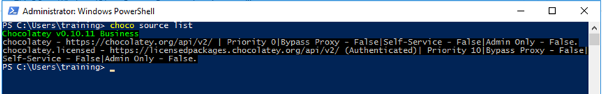
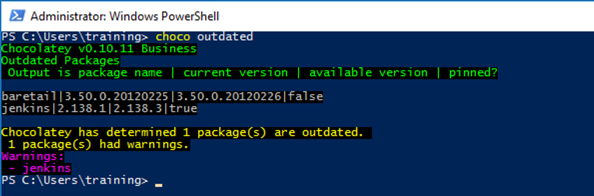
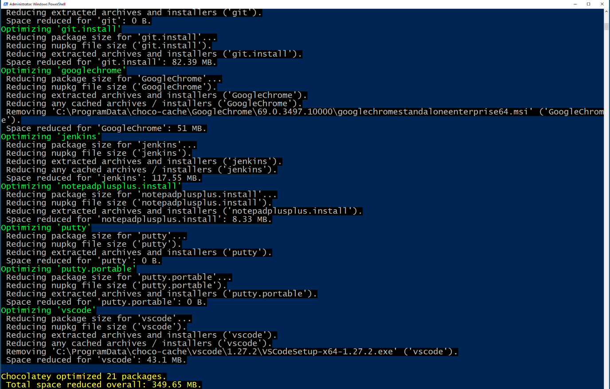
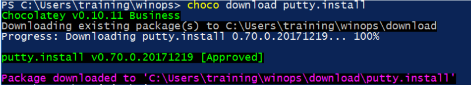
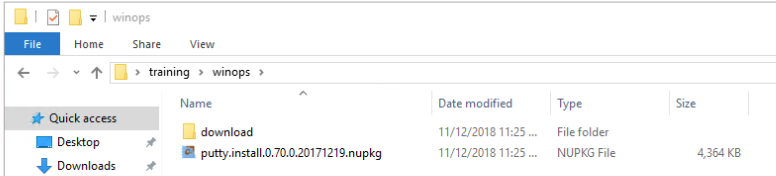
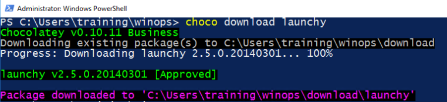
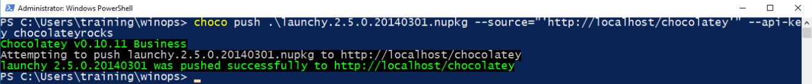

@title[Setting Up Internal Chocolatey Deployments]

## Setting Up Internal Chocolatey Deployments
### Using Jenkins and Package Internalizer


---?image=assets/images/cf2018-sponsors.png&size=contain&color=white
@title[ChocolateyFest Sponsors]
@transition[none]

---?image=assets/images/wifi.png&size=contain&color=white
@title[Wifi]
@transition[none]

---

@title[Who Am I? - Gary Ewan Park]
@transition[none]

@snap[north-west]
@css[choco-blue](WHO AM I?)
@snapend

@snap[west span-65]
Senior Software Engineer @ Chocolatey Software
<br>
<br>


@snapend

@snap[east span-30]

<br>
@css[bio-name](Gary Ewan Park)
@snapend

@snap[south-west bio-contact]
@fa[twitter twitter-blue]&nbsp;&nbsp;gep13&nbsp;&nbsp;&nbsp;&nbsp;&nbsp;
@fa[github text-black]&nbsp;&nbsp;github.com/gep13&nbsp;&nbsp;&nbsp;&nbsp;&nbsp;
@fa[home text-blue]&nbsp;&nbsp;gep13.co.uk&nbsp;&nbsp;&nbsp;&nbsp;&nbsp;
@fa[envelope choco-blue]&nbsp;&nbsp;gary@chocolatey.io
@snapend

---
@title[Who Am I? - Paul Broadwith]
@transition[none]

@snap[north-west]
@css[choco-blue](WHO AM I?)
@snapend

@snap[west span-65]
Senior Technical Engineer @ Chocolatey Software
<br>
<br>
25+ years in IT in the defence, government, financial services and nuclear industry sectors
@snapend

@snap[east span-30]

<br>
@css[bio-name](Paul Broadwith)
@snapend

@snap[south-west bio-contact]
@fa[twitter twitter-blue]&nbsp;&nbsp;pauby&nbsp;&nbsp;&nbsp;&nbsp;&nbsp;
@fa[github text-black]&nbsp;&nbsp;github.com/pauby&nbsp;&nbsp;&nbsp;&nbsp;&nbsp;
@fa[home text-blue]&nbsp;&nbsp;pauby.com&nbsp;&nbsp;&nbsp;&nbsp;&nbsp;
@fa[envelope choco-blue]&nbsp;&nbsp;paul@chocolatey.io
@snapend

---

@title[Agenda]
@transition[none]

@snap[north-west]
@css[choco-blue](Agenda)
@snapend

@title[Agenda]
@transition[none]

@snap[north-west]
@css[choco-blue](Agenda)
@snapend

* 18:30: Workshop Starts
* 19:30: Comfort Break
* 20:30: Comfort Break
* 21:30: Workshop Ends

Please feel free to interrupt for any questions that you might have.

---
@title[Agenda]
@transition[none]

@snap[north-west]
Agenda
@snapend

* Get access to Workshop Environments
* Chocolatey Fundamentals
* Manual Internalization
* Package Internalizer Fundamentals
* Automatic Package Internalization

---

@title[Pre-Requisites]
@transition[none]

@snap[north-west]
@css[choco-blue](Pre-Requisites)
@snapend

* Computer with network connection and RDP client
  * on Windows, you are probably all set
  * on macOS, get Microsoft Remote Desktop from the App Store
  * on Linux, get [rdesktop](https://wiki.ubuntuusers.de/rdesktop/)
* Some Chocolatey knowledge
  * but it's OK if you are not a Chocolatey expert!)

---

@title[Hands-on Sections]
@transition[none]

@snap[north-west]
@css[choco-blue](Hands-on Sections)
@snapend

* This whole workshop is hands-on
* We will use Chocolatey version 0.10.11 Trial Edition
* We will use Chocolatey.Server 0.2.5
* We will use Jenkins 2.138.1
* All hands-on section are clearly identified, like the rectangle below:

---

@title[We will (mostly) interact with RDP only]
@transition[none]

@snap[north-west]
@css[choco-blue](We will, mostly, interact with RDP only)
@snapend

---

@title[Terminals]
@transition[none]

@snap[north-west]
@css[choco-blue](Terminals)
@snapend

Once in a while, the instructions will say:

@quote[Open a new terminal]


This needs to be an Administrator session.
* Press [Windows], type `powershell`, right click on entry and select `Run as Administrator`

---

@title[Test RDP Access]
@transition[none]

@snap[north-west]
@css[choco-blue](Test RDP Access)
@snapend

You should have been given a piece of paper like this:


Test login credentials to make sure you have access.

**NOTE:** Initial login will likely cause a reboot of VM.

---

## Chocolatey Fundamentals

+++

## Exercise - Install putty

```
choco install putty
```

+++

## Result


+++

## Exercise - List local packages

```
choco list -lo
```

```
choco list --local-only
```
+++

## Result


+++

## Exercise - List all packages

```
choco list -li
```

```
choco list --local-only --include-programs
```

+++

## Result


+++

## Exercise - Upgrade all packages

```
choco upgrade all
```

+++

## Result


+++

## Exercise - Chocolatey Sources

```
choco source
```

```
choco source list
```

+++

## Result



+++

## Exercise - choco outdated

```
choco outdated
```

+++

## Result



+++

## Exercise - choco optimize

```
choco optimize
```

```
choco optimize --reduce-nupkg-only
```

+++

## Result


---

@title[Why do I need to internalize packages?]
## Why do I need to internalize packages?

---

@title[What can't I just use the packages downloaded from chocolatey.org?]
## Why can't I just use the packages downloaded from chocolatey.org?

---

## Manual Internalization

```
mkdir chocolateyfest
cd chocolateyfest
choco download putty.install
ii .
```
+++

## Result



+++




+++

## That was too easy..

```
choco download launchy
```

+++

## Result



+++


+++

## Exercise

* Download Launchy.exe
* Place within the chocolatey package folder
* Modify chocolateyInstall.ps1 file to use new location
* Switch to using `Install-ChocolateyInstallPackage`
* Or use `-UseOriginalLocation` flag
* Run `choco pack` to generate package
* Deploy and test

+++

## The easy way...

```
choco download launchy `
  --internalize `
  --internalize-all-urls `
  --append-use-original-location
```

+++

## Result


+++


---

@title[Why use Chocolatey.Server?]
## Why use Chocolatey.Server?

+++

## Exercise - Push Package to Chocolatey.Server

```
choco source list
choco list --source="'http://localhost/chocolatey'"
choco push ./launchy.2.5.0.20140301.nupkg `
  --source="'http://localhost/chocolatey'"
```

This will error out.  We need to know the Api Key to push packages to this feed

+++

## Exercise - Get Api Key

* Navigate to `C:\tools\chocolatey.server`
* Open `web.config` file in text editor
* Search for `apiKey`
* Take a note of the value

+++

## Exercise - Push Package to Chocolatey.Server

```
choco push ./launchy.2.5.0.20140301.nupkg `
  --source="'http://localhost/chocolatey'" `
  --api-key chocolateyrocks
```

+++

## Results



+++

```
choco list --source="'http://localhost/chocolatey'"
```


---

@title[Why use Jenkins?]
## Why use Jenkins?

+++

## Exercise - Jenkins

- Login into Jenkins with username/password
- Find password in secret file
- Talk about plugins, why they are needed
- Scheduling the jobs

---

## Internalize Packages

- Image from docs

+++

## Set up first job

+++

## Set up second job

+++

## Setup third job

---

## Real World Scenarios

- what are we trying to achieve
- using Chocolatey.org as source for new package versions
- internalizing those onto test repository
- testing it out
- pushing to internal production repository

+++

## Exercise - Do that

- Old version of Putty pushed to chocolatey.server
- Run scripts, to watch internalization of new one

---

@title[Questions]
## Questions?

Feel free to get in touch

Email:
gary@chocolatey.io
paul@chocolatey.io

Twitter:
@gep13
@pauby

Web: https://chocolatey.org

---

@title[Resources]
## Resources

* Chocolatey Documentation - https://chocolatey.org/docs
* Gitter Chat - https://gitter.im/chocolatey/choco
* Google Groups - https://groups.google.com/forum/#!forum/chocolatey
* Learning Resources - https://chocolatey.org/docs/resources
* How To Use Package Internalizer To Create Internal Package Source - https://chocolatey.org/docs/how-to-setup-internal-package-repository
